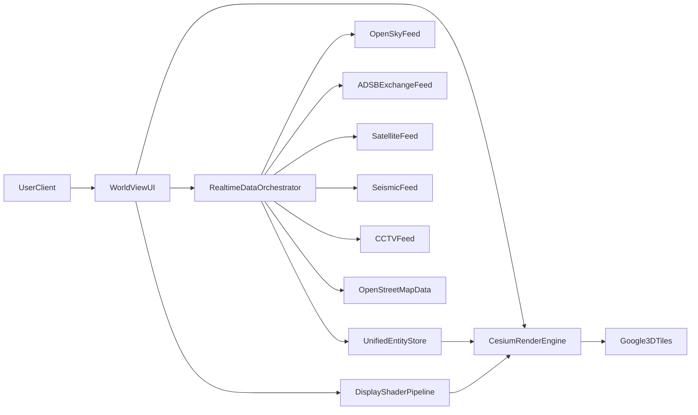

# WorldView Product Requirements Document (PRD)

## 1) Document Control
- **Product**: WorldView
- **Doc Type**: Internal engineering/product PRD
- **Version**: v1.0
- **Status**: Draft for build execution
- **Primary Goal**: Ship a fully working feature-complete WorldView experience from public data feeds and AI-assisted development workflow.

## 2) Product Summary
WorldView is a real-time geospatial fusion interface that combines global 3D visualization with live telemetry and open-source intelligence-style layers. The product merges capabilities similar to Google Earth exploration and tactical multi-feed monitoring in a single web application.

WorldView must provide a continuously updating, operator-friendly 3D command view with:
- Live satellite tracking
- Live commercial and military flight tracking
- Public CCTV feed projection into 3D scene context
- Street traffic simulation
- Earthquake/seismic event overlays
- Tactical display modes (CRT, Night Vision, FLIR-like)

## 3) Goals and Non-Goals
### 3.1 Goals
- Deliver a working end-to-end system where all listed layers load and update in near real-time.
- Provide smooth operator workflows for switching layers, tracking entities, and investigating regions.
- Maintain cinematic/tactical interface quality aligned with the UI reference image at `public/Screenshot 2026-03-02 at 9.57.10 PM.png`.
- Keep architecture modular so each feed can be independently maintained or swapped.

### 3.2 Non-Goals
- Enterprise-grade security/compliance hardening (explicitly out of scope for this PRD version).
- Proprietary/private intelligence feeds.
- Mobile-first optimization (desktop web is primary for v1).

## 4) Success Metrics
### 4.1 Product Success
- All required layers operational in a single session without manual service restarts.
- User can complete key workflows:
  - Track a satellite and inspect orbit path
  - Track commercial and military aircraft
  - Open and view mapped CCTV feeds
  - Toggle seismic and traffic overlays
  - Switch visual modes and adjust visual controls

### 4.2 Technical Success
- Initial globe render: <= 5s on a modern desktop broadband connection.
- Data refresh SLA met for each source (see Section 10).
- Stable 30+ FPS target in tactical mode under normal multi-layer usage.

## 5) Users and Use Cases
### 5.1 Primary Users
- OSINT researchers and analysts
- Aviation and satellite enthusiasts
- Incident monitoring teams (public events/disasters)
- Geospatial developers and technical demonstrators

### 5.2 Core Use Cases
- Regional monitoring: observe airspace, surface movement, and cameras around selected cities.
- Event triage: identify nearby flights, seismic events, and available camera feeds for a location.
- Trend observation: watch movement over time across satellites/flights/traffic.
- Demo/education: showcase modern data-fusion UX built from public sources.

## 6) UI/UX Direction (Reference-Led)
**Primary visual reference**: `public/Screenshot 2026-03-02 at 9.57.10 PM.png`

### 6.1 Visual Design Requirements
- Dark, tactical, high-contrast HUD style with subtle glow accents.
- Fullscreen 3D viewport as dominant canvas with thin side control panels.
- Tactical typography and metadata callouts around viewport perimeter.
- Layered post-processing aesthetic: scanlines, noise/grain, vignette, bloom controls.
- Bottom "style preset" rail for quick mode switching (Normal/CRT/NVG/FLIR and extensible presets).

### 6.2 Interaction Requirements
- One-click mode switching, no page reload.
- Always-visible core controls for data layers and visual tuning.
- Fast camera jump presets for landmarks/cities.
- Context panel on entity select with key fields and actions (track, follow, center, inspect).

### 6.3 Accessibility and Ergonomics
- Provide a "Clean UI" option to reduce tactical overlays.
- Ensure contrast is readable for long-duration use.
- Keyboard shortcuts for mode toggle, follow entity, layer visibility.

## 7) Functional Requirements (Complete Scope)

### 7.1 Base Globe and 3D World
#### Requirements
- Render global 3D scene using Google 3D Tiles as the foundational world layer.
- Support smooth zoom, pan, tilt, heading, and orbit camera operations.
- Integrate CesiumJS-based camera/object interaction patterns for picking, focus, and tracked entities.

#### Acceptance Criteria
- User can navigate from global to city scale without scene breakage.
- Terrain/building context remains visible for all tactical overlays.

### 7.2 Display Modes and Shader Pipeline
#### Requirements
- Support at minimum:
  - Normal
  - CRT
  - Night Vision
  - FLIR-like thermal
- Provide operator controls for:
  - Intensity/sensitivity
  - Sharpness
  - Pixelation/noise
- Apply effects as post-processing stack, not separate scene rerenders.

#### Acceptance Criteria
- Mode switch latency <= 250ms.
- Parameter sliders update output continuously in real time.

### 7.3 Camera Presets and Landmarks
#### Requirements
- Curated city/landmark preset list with one-click camera fly-to.
- Landmark metadata sourced from OpenStreetMap-compatible geodata.
- Camera auto-centers selected landmarks with reasonable default altitude and tilt.

#### Acceptance Criteria
- At least 20 global presets are available in v1.
- Fly-to completes with smooth animation and no camera clipping.

### 7.4 Live Satellite Tracking
#### Requirements
- Display active satellites globally with position updates.
- Support selecting one satellite to:
  - Follow object
  - Display metadata
  - Render orbital path (historical and predicted segment where available)
- Include filter/search by name/identifier.

#### Acceptance Criteria
- Satellite layer renders and updates continuously.
- Follow mode keeps satellite centered until user cancels.

### 7.5 Real-Time Commercial Flight Layer
#### Requirements
- Integrate OpenSky Network data feed for live commercial flight positions.
- Render aircraft entities with heading and altitude-aware representation.
- Support filtering by callsign, altitude range, and speed range.

#### Acceptance Criteria
- Layer shows live aircraft counts and updates on configured interval.
- Selecting aircraft reveals essential telemetry in info panel.

### 7.6 Military Flight Layer
#### Requirements
- Integrate ADS-B Exchange feed for military-relevant aircraft visibility.
- Differentiate military feed entities from commercial entities visually.
- Allow combined and isolated viewing (commercial-only, military-only, both).

#### Acceptance Criteria
- Military layer can be toggled independently.
- Aircraft from this source remain queryable/selectable in UI.

### 7.7 Street Traffic Simulation
#### Requirements
- Build road-network-derived simulation using OpenStreetMap graph data.
- Use particle/agent-based animation to emulate directional flow.
- Traffic intensity adjustable by user (low/medium/high) per region.

#### Acceptance Criteria
- City-level simulation runs without blocking other live layers.
- Traffic flow follows road geometry and directional continuity.

### 7.8 Real-Time CCTV Layer
#### Requirements
- Ingest publicly accessible camera feeds with geolocation metadata.
- Project feed anchors into 3D world at camera positions.
- Support open-on-select panel to view live stream.
- Show camera status (online/offline/lagging).

#### Acceptance Criteria
- User can select a mapped camera and view associated live content.
- Offline feeds degrade gracefully with status messaging.

### 7.9 Earthquake and Seismic Layer
#### Requirements
- Ingest real-time seismic events and render global markers.
- Encode magnitude and recency visually.
- Support time-window filtering (e.g., last 1h, 24h, 7d).

#### Acceptance Criteria
- Newly ingested events appear without full app reload.
- Event selection shows place, magnitude, timestamp, depth.

### 7.10 Layer Controls and Investigation Workflow
#### Requirements
- Central layer manager with visibility toggles and per-layer opacity/intensity.
- Unified entity inspector panel for all object types.
- Search box for entities/locations and quick center/follow.
- Timeline scrubber/playback mode for recent history where data permits.

#### Acceptance Criteria
- User can combine at least 4 simultaneous layers while maintaining usability.
- Investigative workflow from location search -> layer filter -> entity inspect works end-to-end.

## 8) Data Sources and Contracts

### 8.1 Source Inventory
- Google 3D Tiles (world geometry)
- OpenStreetMap (landmarks + road graph basis)
- OpenSky Network (commercial flights)
- ADS-B Exchange (military/crowdsourced flight visibility)
- Satellite telemetry source(s) (active orbit objects)
- Public CCTV feed directories/endpoints
- Seismic event feed(s)

### 8.2 Normalized Entity Model
All ingested data is normalized into a shared schema envelope:
- `entityType`: `satellite | aircraft_commercial | aircraft_military | cctv_camera | seismic_event | traffic_agent | landmark`
- `source`: provider name
- `entityId`: globally unique stable identifier
- `position`: `{lat, lon, alt?}`
- `heading?`, `speed?`, `status?`, `timestamp`, `metadata`
- `quality`: freshness score + confidence/availability markers

### 8.3 Refresh and Staleness
- Each feed has configurable poll/stream cadence.
- Stale threshold per feed class (fast-moving vs static sources).
- Stale entities remain visible with stale badge, then expire after TTL.

## 9) System Architecture

### 9.1 High-Level Components
- **Frontend App**: UI shell, layer controls, entity inspector, preset manager.
- **Render Engine**: Cesium-driven scene integration, layer compositing, entity rendering.
- **Shader/Post FX Module**: tactical visual modes and live parameter tuning.
- **Realtime Data Orchestrator**: fetch, parse, normalize, cache, and publish updates.
- **Feed Connectors**: source-specific adapters with retry/fallback logic.
- **Unified Entity Store**: in-memory indexed state for render + UI consumption.

### 9.2 Architecture Diagram

### 9.3 Data Flow
1. Connector fetches source payload.
2. Adapter validates/transforms into normalized entity envelope.
3. Orchestrator updates Unified Entity Store (delta apply).
4. Render engine subscribes to store changes and updates scene objects.
5. UI panels bind to same state for synchronized inspect/filter actions.

### 9.4 Performance Strategy
- Use batched updates for high-volume moving entities.
- Prefer incremental diff application over full re-render.
- Use level-of-detail behavior by zoom range for dense layers.
- Keep heavy post-processing optional/tunable.

## 10) Operational Requirements (No Deep Security Section)

### 10.1 Data Freshness Targets
- Flights/satellites: update every 2-10 seconds depending on source limits.
- Seismic: update every 30-120 seconds.
- CCTV availability: health check + reconnect policy every 15-60 seconds.
- Traffic simulation: local deterministic updates every frame/tick.

### 10.2 Reliability Requirements
- Connector retries with exponential backoff.
- Partial-feed failure must not crash global scene.
- Source outage surfaces warning badges and fallback copy in UI.

### 10.3 Observability Requirements
- Structured logs per connector (`source`, `latencyMs`, `recordsIn`, `errors`).
- Frame timing and render diagnostics panel for debugging.
- Feed health dashboard in dev mode.

## 11) Feature-by-Feature Acceptance Criteria
- **Base 3D globe**: navigable global scene with city-level detail.
- **Display modes**: all listed modes switchable with tunable controls.
- **Camera presets**: one-click fly-to for predefined landmarks.
- **Satellites**: live objects visible, selectable, and followable with path.
- **Commercial flights**: OpenSky aircraft displayed and filterable.
- **Military flights**: ADS-B exchange entities displayed distinctly.
- **Traffic**: road-constrained animated flow simulation in selected cities.
- **CCTV**: geolocated cameras selectable with live stream panel.
- **Seismic**: live events rendered with magnitude/time context.
- **Layer manager**: independent toggles + combined multi-layer analysis.

## 12) End-to-End Test Plan

### 12.1 Smoke Tests
- App boots and renders world.
- User can open layer panel and toggle each layer on/off.
- No fatal errors when one feed is unavailable.

### 12.2 Functional Scenario Tests
- **Scenario A**: City preset -> enable flights + CCTV -> inspect aircraft -> open camera feed.
- **Scenario B**: Enable satellites -> follow one object -> switch to FLIR -> return to normal mode.
- **Scenario C**: Seismic event appears -> filter to last 24h -> inspect event details.
- **Scenario D**: Traffic simulation on -> camera fly-through -> verify smooth interaction with other layers enabled.

### 12.3 Performance Tests
- Measure FPS at low/medium/high layer density.
- Measure update latency from ingest to render for each source class.
- Validate mode-switch latency and UI responsiveness under load.

## 13) Roadmap and Milestones

### Phase 1: Foundation (Week 1)
- Cesium scene setup, Google 3D Tiles integration, base UI shell.
- Tactical mode framework and initial shader pipeline.

### Phase 2: Orbital + Air Layers (Week 2)
- Satellite connector + render system + follow/orbit path.
- OpenSky and ADS-B connectors + aircraft rendering and filters.

### Phase 3: Ground Intelligence Layers (Week 3)
- OSM landmarks/presets and traffic simulation.
- CCTV ingest, geolocation mapping, and stream panels.
- Seismic feed ingest and visualization.

### Phase 4: Integration and Release Readiness (Week 4)
- Unified layer manager, timeline/search polish.
- Performance tuning, bug fixing, and acceptance sign-off.

## 14) Dependencies and Risks

### 14.1 External Dependencies
- Third-party feed availability and rate limits.
- Terms/licensing constraints for public data reuse.
- Web rendering performance variability across GPUs/browsers.

### 14.2 Delivery Risks
- Inconsistent feed schemas requiring robust adapter maintenance.
- CCTV endpoints with unstable uptime/format mismatch.
- High object counts reducing FPS on lower-end devices.

### 14.3 Mitigations
- Build connector abstraction + strict schema normalization.
- Add stale-state UX and graceful degradation.
- Implement LOD and adaptive rendering quality controls.

## 15) Assumptions and Out of Scope

### 15.1 Assumptions
- Public feed APIs are sufficiently accessible for demo/prototype-level throughput.
- Desktop browser environment is the main target.
- Team accepts iterative tuning for data quality edge cases.

### 15.2 Out of Scope for This PRD
- Full security/compliance design.
- Multi-tenant account system and role-based governance.
- Proprietary defense-grade data fusion integrations.

## 16) Suggested Build Stack (Implementation Guidance)
- **Frontend**: TypeScript + modern web framework
- **3D Engine**: CesiumJS for globe, entities, and camera workflows
- **Data Layer**: Source connector services + normalization pipeline
- **State**: Unified reactive store with indexed entities
- **Rendering FX**: WebGL/post-processing shader chain for tactical modes

## 17) Appendix: Source Links
- Google 3D Tiles: https://developers.google.com/maps
- OpenSky Network: https://opensky-network.org
- ADS-B Exchange: https://adsbexchange.com
- CesiumJS: https://cesium.com

---

## Implementation Note on External Library Guidance
This PRD reflects external library guidance aligned with:
- CesiumJS documentation patterns for time-dynamic entity rendering and camera control.
- Google Maps JavaScript/WebGL overlay and 3D map reference constraints relevant to advanced web geospatial rendering integrations.
